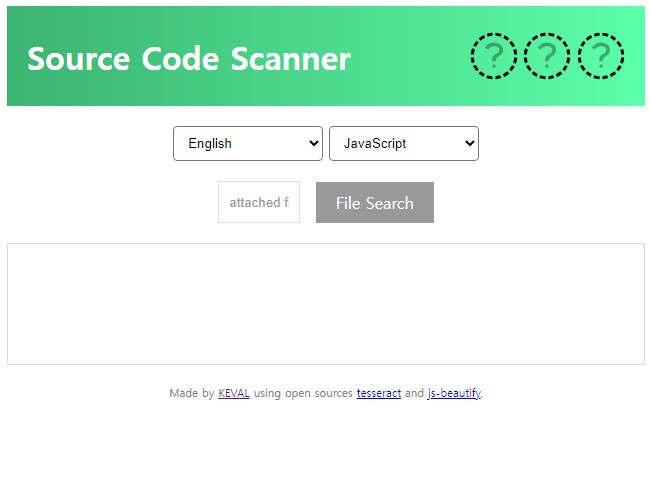

# Code Scanner OCR
**코드 스캐너 OCR** 

## 개요 | Outline

소스 코드가 적힌 이미지를 광학 문자 인식(Optical Character Recognition) 기술로 스캔 후, 코드 텍스트 형식으로 표시해주는 프로그램입니다. 출력된 코드는 전문을 그대로 복사할 수 있습니다.

이런 상황에서 유용합니다!
* 소스코드가 종이 출력물 상태로만 있을 때
* 소스코드가 PDF 파일 형식으로만 있을 때
* 소스코드가 복사가 안돼서 캡쳐했을 때

The program scans images containing source code using Optical Character Recognition (OCR) technology and displays the code textually. The outputted code can be copied as is.

It is useful in situations such as:
* When the source code exists only in hard copy format.
* When the source code is in PDF file format.
* When the source code cannot be copied directly, so it was captured instead.

## 사용법 | How to use

➡️[This Link](https://kevalsil.com/code-scanner/)⬅️

**이 링크에서 사용할 수 있습니다.** 
**You can find it here**

1. 이미지를 첨부하기 전, 이미지에 적힌 언어 종류를 선택하세요. Please select the language of the text written in the image before attaching it.
2. 소스 코드가 적힌 이미지를 첨부하세요. Attach the image containing the source code.
3. 결과를 확인하고 복사하세요! Check the result and copy the text!

## 작동 원리 | How it works

본 프로그램은 [tesseract](https://github.com/tesseract-ocr/tesseract)와 [js-beautify](https://github.com/beautifier/js-beautify)가 사용되었습니다. tesseract가 이미지 파일 내 텍스트를 인식해 텍스트로 반환하고, js-beautify가 이를 가독성 좋게 정렬합니다.

This program utilizes [Tesseract](https://github.com/tesseract-ocr/tesseract) and [js-beautify](https://github.com/beautifier/js-beautify). Tesseract is used to recognize text within image files and convert it into text format, while js-beautify formats the text for better readability.

## 기타자료 | Other data

  
-

  -

